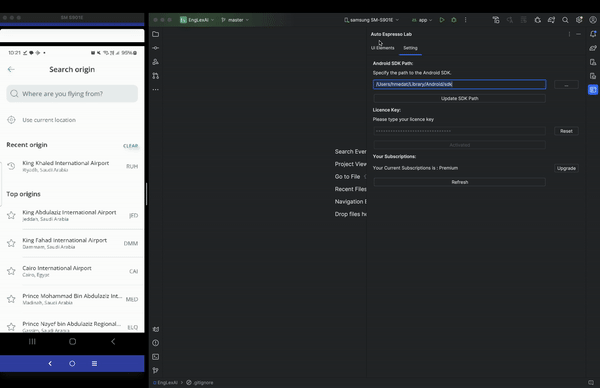
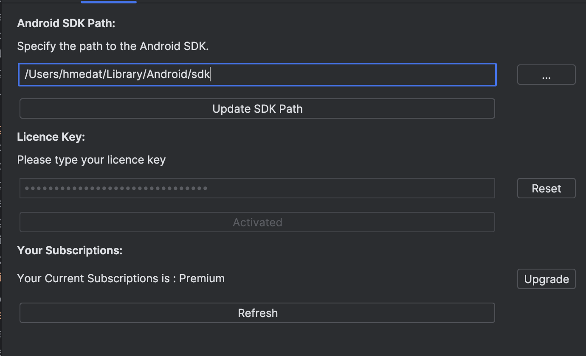
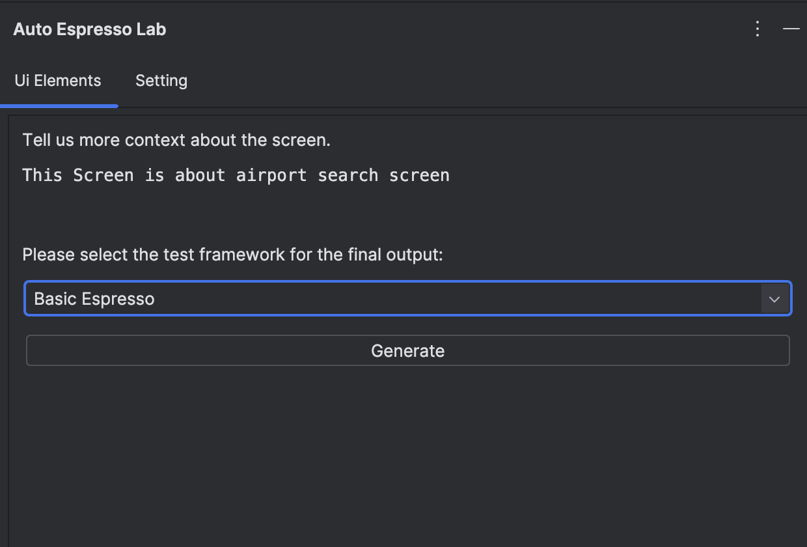
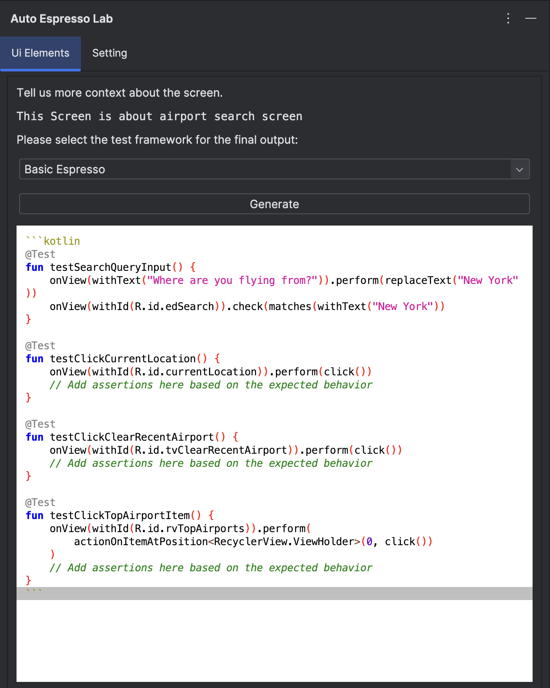

# 🧪 EspressoLab AI Tool

## Introduction

EspressoLab AI Tool leverages GPT-4 to generate comprehensive UI tests automatically. Our tool analyzes device screenshots and creates detailed UI test cases, eliminating the need for manual test writing. Say goodbye to the tedious task of finding element IDs. Our AI tool seamlessly identifies and integrates element IDs into your test cases, streamlining your QA process. Easily export your tests in Espresso or Compose formats. Our tool provides ready-to-copy test cases, including custom builders, ensuring smooth integration into your codebase.

## Demonstration

  

## Target Audience

- 👩‍💻 Android QA Engineers

## System Requirements

- 🛠️ Android Studio

## Installation

1. **Download the Plugin**:
   - 📥 Download the plugin from the IntelliJ Store: [EspressoLab AI Tool](https://plugins.jetbrains.com/plugin/23737-autoespressolab).

2. **Set the Android Path**:
   - 🔧 Go to the **Settings** tab.
   - 🗂️ Fill in the SDK path and click **Update**.
   - 💡 Note: You can use the tool for free, and you don't have to complete any registration steps.

   

3. **Configure UI Elements**:
   - 📝 Go to the **UiElements** tab.
   - 🖥️ Fill in the context about the screen to help us understand your screen logic.
   - 📱 Ensure the device is on and you are opening the screen you want to test.

   

4. **Final Output**:
   - 🎉 After generating, you will see the final output as shown below.

   

## Features

- 🤖 **AI-Generated UI Tests**: Uses GPT-4 to generate UI tests based on a trained model, providing comprehensive test cases.
- 🔍 **Effortless Element Identification**: Automatically identifies and integrates element IDs into your test cases.
- 🚀 **Export Ready Tests**: Easily export your tests in Espresso or Compose formats, including custom builders.

## Usage

1. **Generate Tests**:
   - 🔌 Ensure your device is connected and the screen you want to test is open.
   - 📝 Fill in the context about the screen in the **UiElements** tab.
   - ▶️ Run the tool to generate the UI tests automatically.

2. **Export Tests**:
   - 📂 Choose the export format (Espresso or Compose).
   - 📋 Copy the generated test cases into your codebase for seamless integration.

## Troubleshooting

- **Common Issues**:
  - ❓ **Issue**: The tool is not recognizing the device.
  - 🔧 **Solution**: Ensure the device is properly connected and the correct screen is open.

- **Logs and Debug Information**:
  - 🗃️ Check the tool's log files for any error messages or warnings.

## Contact Information

- 🌐 Visit our website: [EspressoLab AI](https://espressolab.ai/)
- 📧 Support Email: [support@espressolab.ai](mailto:support@espressolab.ai)

